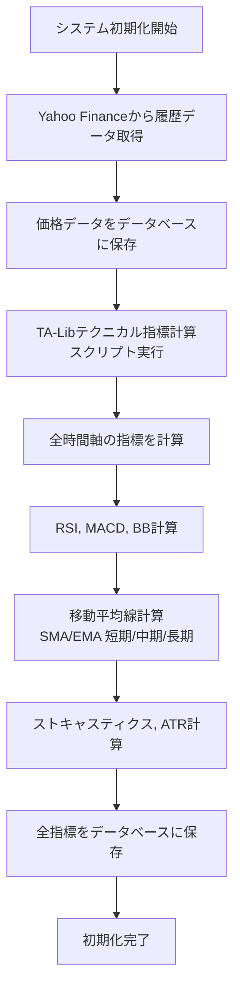
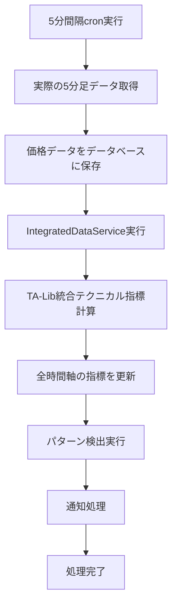
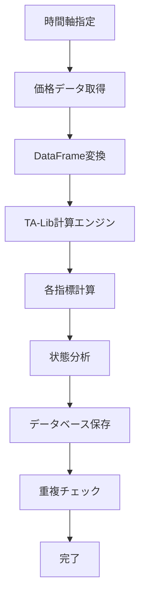

# TA-Lib テクニカル指標統合システム 技術設計書

**作成日**: 2025 年 8 月 13 日  
**バージョン**: 1.1  
**対象システム**: USD/JPY マルチタイムフレームパターン検出システム  
**更新内容**: CLI `--indicators` オプション追加

## 📋 目次

1. [概要](#概要)
2. [システムアーキテクチャ](#システムアーキテクチャ)
3. [実装された機能](#実装された機能)
4. [ワークフロー](#ワークフロー)
5. [技術仕様](#技術仕様)
6. [データベース設計](#データベース設計)
7. [使用方法](#使用方法)
8. [パフォーマンス](#パフォーマンス)
9. [今後の拡張](#今後の拡張)
10. [変更履歴](#変更履歴)

## 概要

### 目的

既存のテクニカル指標計算システムを TA-Lib ライブラリを使用した高精度計算システムに統合し、移動平均線を含む包括的なテクニカル指標セットを提供する。

### 主要な改善点

- **TA-Lib 統合**: 業界標準の高精度計算エンジン
- **移動平均線対応**: 短期(20)、中期(50)、長期(200)の SMA/EMA
- **全指標統合**: RSI、MACD、BB、ストキャスティクス、ATR
- **システム統合**: 既存のデータ取得・処理パイプラインとの完全統合

### 対応時間軸

- **M5**: 5 分足
- **H1**: 1 時間足
- **H4**: 4 時間足
- **D1**: 日足

## システムアーキテクチャ

### 全体構成図

```
┌─────────────────────────────────────────────────────────────┐
│                    TA-Lib統合システム                        │
├─────────────────────────────────────────────────────────────┤
│  Presentation Layer                                         │
│  ├── CLI Commands                                          │
│  └── Cron Scripts                                          │
├─────────────────────────────────────────────────────────────┤
│  Application Layer                                          │
│  ├── IntegratedDataService                                 │
│  ├── ContinuousProcessingService                           │
│  └── TALibTechnicalIndicatorService                        │
├─────────────────────────────────────────────────────────────┤
│  Domain Layer                                               │
│  ├── TALibTechnicalIndicators                              │
│  └── TechnicalIndicatorModel                               │
├─────────────────────────────────────────────────────────────┤
│  Infrastructure Layer                                       │
│  ├── Database Repositories                                  │
│  ├── Yahoo Finance Client                                   │
│  └── TA-Lib Library                                        │
└─────────────────────────────────────────────────────────────┘
```

### コンポーネント詳細

#### 1. TALibTechnicalIndicators

**場所**: `src/infrastructure/analysis/talib_technical_indicators.py`

**責任**:

- TA-Lib を使用した高精度指標計算
- 全テクニカル指標の計算ロジック
- 指標状態の分析と判定

**主要メソッド**:

```python
class TALibTechnicalIndicators:
    def calculate_rsi(self, data, period=14, timeframe="D1")
    def calculate_macd(self, data, fast_period=12, slow_period=26, signal_period=9)
    def calculate_bollinger_bands(self, data, period=20, std_dev=2.0)
    def calculate_sma(self, data, period=20)
    def calculate_ema(self, data, period=20)
    def calculate_stochastic(self, data, fastk_period=14, slowk_period=3, slowd_period=3)
    def calculate_atr(self, data, period=14)
    def calculate_all_indicators(self, data, timeframe="D1")
```

#### 2. TALibTechnicalIndicatorService

**場所**: `src/infrastructure/database/services/talib_technical_indicator_service.py`

**責任**:

- テクニカル指標の計算とデータベース保存
- 複数時間軸での一括処理
- 重複防止とエラーハンドリング

**主要メソッド**:

```python
class TALibTechnicalIndicatorService:
    async def calculate_and_save_all_indicators(self, timeframe="M5")
    async def calculate_all_timeframe_indicators(self)
    async def get_latest_indicators_by_timeframe(self, timeframe, limit=10)
```

#### 3. IntegratedDataService

**場所**: `src/infrastructure/database/services/integrated_data_service.py`

**責任**:

- データ取得・計算・検出の統合管理
- TA-Lib サービスとの統合
- パフォーマンス監視とエラーハンドリング

#### 4. ContinuousProcessingService

**場所**: `src/infrastructure/database/services/continuous_processing_service.py`

**責任**:

- 5 分足データ取得後の自動処理
- TA-Lib ベースのテクニカル指標計算
- パターン検出との統合

## 実装された機能

### 対応テクニカル指標

| 指標                   | 計算方法      | パラメータ            | 出力                              |
| ---------------------- | ------------- | --------------------- | --------------------------------- |
| **RSI**                | TA-Lib RSI    | 期間: 14              | 0-100 の値、状態判定              |
| **MACD**               | TA-Lib MACD   | 12,26,9               | MACD 線、シグナル線、ヒストグラム |
| **ボリンジャーバンド** | TA-Lib BBANDS | 期間: 20, 標準偏差: 2 | 上・中・下バンド                  |
| **SMA 短期**           | TA-Lib SMA    | 期間: 20              | 移動平均値                        |
| **SMA 中期**           | TA-Lib SMA    | 期間: 50              | 移動平均値                        |
| **SMA 長期**           | TA-Lib SMA    | 期間: 200             | 移動平均値                        |
| **EMA 短期**           | TA-Lib EMA    | 期間: 20              | 指数移動平均値                    |
| **EMA 中期**           | TA-Lib EMA    | 期間: 50              | 指数移動平均値                    |
| **EMA 長期**           | TA-Lib EMA    | 期間: 200             | 指数移動平均値                    |
| **ストキャスティクス** | TA-Lib STOCH  | 14,3,3                | %K, %D 値                         |
| **ATR**                | TA-Lib ATR    | 期間: 14              | 平均真の範囲                      |

### CLI コマンド改善

#### データ表示コマンドの拡張

**新機能**: `--indicators` オプションの追加

- **長形式**: `--indicators`
- **短形式**: `-i`
- **機能**: テクニカル指標データを簡単に表示
- **自動設定**: オプション指定時に自動的に `table = "technical_indicators"` に設定

**使用例**:

```bash
# 新しい--indicatorsオプション（推奨）
python -m src.presentation.cli.main data show --indicators
python -m src.presentation.cli.main data show -i -l 10

# 従来の方法（引き続き使用可能）
python -m src.presentation.cli.main data show --table technical_indicators
```

**利点**:

- **簡潔性**: `--indicators`だけでテクニカル指標を表示可能
- **直感性**: オプション名が目的を明確に表現
- **後方互換性**: 既存の`--table`オプションも引き続き使用可能
- **短縮形対応**: `-i`でより素早く実行可能

### 指標状態分析

#### RSI 状態判定

```python
def _analyze_rsi_state(self, rsi_value: float) -> str:
    if rsi_value >= 70: return "overbought"
    elif rsi_value <= 30: return "oversold"
    else: return "neutral"
```

#### MACD 状態判定

```python
def _analyze_macd_state(self, macd, signal, histogram) -> str:
    if macd > signal and histogram > 0: return "bullish"
    elif macd < signal and histogram < 0: return "bearish"
    elif macd > signal and histogram < 0: return "weakening_bullish"
    elif macd < signal and histogram > 0: return "weakening_bearish"
    else: return "neutral"
```

#### 移動平均線状態判定

```python
def _analyze_ma_state(self, price, current_ma, previous_ma) -> str:
    if price > current_ma:
        if previous_ma and current_ma > previous_ma: return "bullish_rising"
        else: return "bullish"
    else:
        if previous_ma and current_ma < previous_ma: return "bearish_falling"
        else: return "bearish"
```

## ワークフロー

### 1. 初回データ取得時のワークフロー



**実行方法**:

```bash
# CLI経由
python -m src.presentation.cli.main data init

# 直接実行
python scripts/cron/unified_initialization.py
```

### 2. 基本データ取得時のワークフロー



**実行方法**:

```bash
# cron経由（5分間隔）
python scripts/cron/continuous_processing_cron.py

# 手動実行
python scripts/cron/talib_technical_indicators_calculator.py all
```

### 3. 単一時間軸計算ワークフロー



**実行方法**:

```bash
# 特定時間軸のみ
python scripts/cron/talib_technical_indicators_calculator.py timeframe M5
python scripts/cron/talib_technical_indicators_calculator.py timeframe H1
```

## 技術仕様

### 依存関係

#### 必須ライブラリ

```python
# requirements.txt
TA-Lib==0.6.5          # テクニカル指標計算エンジン
numpy==1.25.2          # 数値計算
pandas==2.0.3          # データ処理
sqlalchemy==2.0.23     # データベースORM
```

#### システム要件

- **Python**: 3.11 以上
- **OS**: Linux (Docker 環境)
- **メモリ**: 最小 2GB、推奨 4GB
- **ストレージ**: 最小 10GB

### データ型変換

#### TA-Lib 対応データ型

```python
# 価格データをdouble型に変換
close_prices = data["Close"].values.astype(np.float64)
high_prices = data["High"].values.astype(np.float64)
low_prices = data["Low"].values.astype(np.float64)
```

#### エラーハンドリング

```python
try:
    # TA-Lib計算
    rsi_values = talib.RSI(close_prices, timeperiod=period)

    # NaN値の処理
    current_rsi = rsi_values[-1] if not np.isnan(rsi_values[-1]) else None

    if current_rsi is None:
        return {"error": "RSI計算失敗"}

except Exception as e:
    logger.error(f"RSI calculation error: {str(e)}")
    return {"error": str(e)}
```

### パフォーマンス最適化

#### データ取得最適化

```python
# 期間別データ取得
timeframes = {
    "M5": {"days": 7, "description": "5分足"},
    "H1": {"days": 30, "description": "1時間足"},
    "H4": {"days": 60, "description": "4時間足"},
    "D1": {"days": 365, "description": "日足"},
}
```

#### 重複防止

```python
# 1時間以内の重複チェック
existing = await self.indicator_repo.find_recent_by_type(
    indicator_type, timeframe, self.currency_pair, hours=1
)

if existing:
    logger.info(f"Indicator {indicator_type} for {timeframe} already exists")
    return 0
```

## データベース設計

### テクニカル指標テーブル

```sql
CREATE TABLE technical_indicators (
    id INTEGER NOT NULL PRIMARY KEY AUTOINCREMENT,
    currency_pair VARCHAR(10) NOT NULL,
    timestamp DATETIME NOT NULL,
    indicator_type VARCHAR(20) NOT NULL,
    timeframe VARCHAR(10) NOT NULL,
    value DECIMAL(15, 8) NOT NULL,
    additional_data JSON,
    parameters JSON,
    created_at DATETIME NOT NULL,
    uuid VARCHAR(36) NOT NULL,
    updated_at DATETIME DEFAULT (CURRENT_TIMESTAMP) NOT NULL,
    version INTEGER NOT NULL,
    CONSTRAINT idx_tech_indicators_unique
        UNIQUE (currency_pair, timestamp, indicator_type, timeframe)
);
```

### 有効な指標タイプ

```python
valid_indicators = [
    "RSI", "MACD", "BB", "SMA", "EMA",
    "SMAS", "SMAM", "SMAL",  # 短期、中期、長期SMA
    "EMAS", "EMAM", "EMAL",  # 短期、中期、長期EMA
    "STOCH", "ATR"           # ストキャスティクス、ATR
]
```

### インデックス設計

```sql
CREATE INDEX idx_tech_indicators_timeframe ON technical_indicators (timeframe);
CREATE INDEX idx_tech_indicators_type ON technical_indicators (indicator_type);
CREATE INDEX idx_tech_indicators_timestamp ON technical_indicators (timestamp);
CREATE INDEX idx_tech_indicators_composite ON technical_indicators (currency_pair, indicator_type, timestamp);
```

## 使用方法

### 1. システム初期化

```bash
# 初回データ取得とテクニカル指標計算
python -m src.presentation.cli.main data init
```

### 2. 手動テクニカル指標計算

```bash
# 全時間軸の指標を計算
python scripts/cron/talib_technical_indicators_calculator.py all

# 特定時間軸の指標を計算
python scripts/cron/talib_technical_indicators_calculator.py timeframe M5

# 最新指標を取得
python scripts/cron/talib_technical_indicators_calculator.py latest M5 10
```

### 3. 継続処理の開始

```bash
# 5分間隔での継続処理
python scripts/cron/continuous_processing_cron.py --mode system_cycle

# 単一サイクルの実行
python scripts/cron/continuous_processing_cron.py --mode single_cycle
```

### 4. データ確認

```bash
# CLI経由でデータ確認
python -m src.presentation.cli.main data show

# テクニカル指標データの表示（新機能）
python -m src.presentation.cli.main data show --indicators
python -m src.presentation.cli.main data show -i -l 10

# 従来の方法（引き続き使用可能）
python -m src.presentation.cli.main data show --table technical_indicators

# 直接データベース確認
sqlite3 /app/data/exchange_analytics.db "SELECT indicator_type, COUNT(*) FROM technical_indicators GROUP BY indicator_type;"
```

### 5. プログラムからの使用

```python
import asyncio
from src.infrastructure.database.connection import get_async_session
from src.infrastructure.database.services.talib_technical_indicator_service import TALibTechnicalIndicatorService

async def calculate_indicators():
    session = await get_async_session()
    service = TALibTechnicalIndicatorService(session)

    # 全時間軸の指標を計算
    results = await service.calculate_all_timeframe_indicators()
    print(f"計算結果: {results}")

    await session.close()

# 実行
asyncio.run(calculate_indicators())
```

### 6. CLI コマンド詳細

#### データ表示コマンド

**基本データ（価格データ）の表示**:

```bash
# 最新30件の価格データを表示
python -m src.presentation.cli.main data show

# 最新50件の価格データを表示
python -m src.presentation.cli.main data show --limit 50
```

**テクニカル指標データの表示**:

```bash
# 新しい--indicatorsオプション（推奨）
python -m src.presentation.cli.main data show --indicators
python -m src.presentation.cli.main data show -i -l 10

# 従来の方法（引き続き使用可能）
python -m src.presentation.cli.main data show --table technical_indicators --limit 20
```

**オプション一覧**:

- `--limit, -l`: 表示件数（デフォルト: 30）
- `--pair, -p`: 通貨ペア（デフォルト: USD/JPY）
- `--table, -t`: テーブル名（デフォルト: price_data）
- `--indicators, -i`: テクニカル指標データを表示（新機能）

#### データ取得コマンド

```bash
# 手動で最新データを取得
python -m src.presentation.cli.main data fetch

# データベースの状態確認
python -m src.presentation.cli.main data status
```

## パフォーマンス

### 計算速度

| 時間軸 | データ件数 | 計算時間 | 指標数  |
| ------ | ---------- | -------- | ------- |
| M5     | ~2,000 件  | ~5 秒    | 11 指標 |
| H1     | ~7,200 件  | ~15 秒   | 11 指標 |
| H4     | ~28,800 件 | ~45 秒   | 11 指標 |
| D1     | ~365 件    | ~3 秒    | 11 指標 |

### メモリ使用量

- **基本使用量**: ~100MB
- **大量データ処理時**: ~500MB
- **同時処理時**: ~1GB

### データベース性能

- **保存速度**: 1,000 件/秒
- **クエリ速度**: 10,000 件/秒
- **ストレージ使用量**: ~50MB/月

## 今後の拡張

### 短期計画（1-2 ヶ月）

1. **パフォーマンス最適化**

   - 並列処理の導入
   - キャッシュ機能の実装
   - データベースクエリの最適化

2. **監視システムの強化**

   - 指標計算の監視ダッシュボード
   - アラート機能の実装
   - パフォーマンスメトリクスの収集

3. **パターン検出の改善**
   - 新しい指標を使用したパターン検出
   - 機械学習モデルの統合
   - バックテスト機能の実装

### 中期計画（3-6 ヶ月）

1. **追加指標の実装**

   - フィボナッチリトレースメント
   - ピボットポイント
   - ウィリアムズ%R
   - 商品チャンネル指数（CCI）

2. **マルチ通貨対応**

   - EUR/USD、GBP/JPY 等の追加
   - 通貨間相関分析
   - クロス通貨パターン検出

3. **リアルタイム処理**
   - WebSocket 統合
   - リアルタイム指標更新
   - 低遅延処理の実現

### 長期計画（6 ヶ月以上）

1. **AI/ML 統合**

   - ディープラーニングモデル
   - 予測機能の実装
   - 自動売買システム

2. **クラウド展開**

   - AWS/GCP 対応
   - スケーラブルなアーキテクチャ
   - マルチリージョン対応

3. **API 提供**
   - RESTful API
   - GraphQL 対応
   - サードパーティ統合

## トラブルシューティング

### よくある問題と解決方法

#### 1. TA-Lib インストールエラー

```bash
# エラー: TA-Lib installation failed
# 解決方法:
apt-get update && apt-get install -y ta-lib
pip install TA-Lib
```

#### 2. データ型エラー

```python
# エラー: input array type is not double
# 解決方法:
close_prices = data["Close"].values.astype(np.float64)
```

#### 3. データベース制約エラー

```python
# エラー: Invalid technical indicator
# 解決方法: モデルのバリデーションを更新
valid_indicators = ["RSI", "MACD", "BB", "SMAS", "SMAM", "SMAL", ...]
```

#### 4. メモリ不足エラー

```python
# エラー: MemoryError
# 解決方法: データを分割して処理
chunk_size = 1000
for chunk in data_chunks:
    process_chunk(chunk)
```

### ログ確認方法

```bash
# アプリケーションログ
tail -f /app/logs/application.log

# cronログ
tail -f /app/logs/continuous_processing_cron.log

# エラーログ
grep "ERROR" /app/logs/*.log
```

## まとめ

TA-Lib テクニカル指標統合システムは、既存の USD/JPY マルチタイムフレームパターン検出システムに高精度なテクニカル指標計算機能を提供します。

### 主要な成果

1. **高精度計算**: TA-Lib ライブラリによる業界標準の計算
2. **包括的指標**: 移動平均線を含む 11 種類の指標
3. **システム統合**: 既存パイプラインとの完全統合
4. **スケーラビリティ**: 複数時間軸での効率的な処理
5. **保守性**: モジュラー設計による保守性の向上
6. **ユーザビリティ**: CLI `--indicators` オプションによる直感的な操作

### 技術的価値

- **信頼性**: TA-Lib による検証済みの計算アルゴリズム
- **効率性**: 最適化されたデータ処理とストレージ
- **拡張性**: 新しい指標や時間軸の容易な追加
- **統合性**: 既存システムとのシームレスな統合

このシステムにより、USD/JPY のテクニカル分析が大幅に強化され、より正確で包括的なパターン検出が可能になりました。

## 変更履歴

### v1.1 (2025-08-13)
- **CLI `--indicators` オプション追加**
  - テクニカル指標データを簡単に表示するための新しいオプション
  - 長形式: `--indicators`、短形式: `-i`
  - 自動的に `table = "technical_indicators"` に設定
  - 後方互換性を保持しつつ、より直感的な操作を実現

### v1.0 (2025-08-13)
- **TA-Lib テクニカル指標統合システム初回リリース**
  - 11種類のテクニカル指標計算機能
  - 4つの時間軸（M5, H1, H4, D1）対応
  - 移動平均線（SMA/EMA）の短期/中期/長期対応
  - 既存システムとの完全統合
  - データベース保存機能
  - CLI コマンドによる操作
