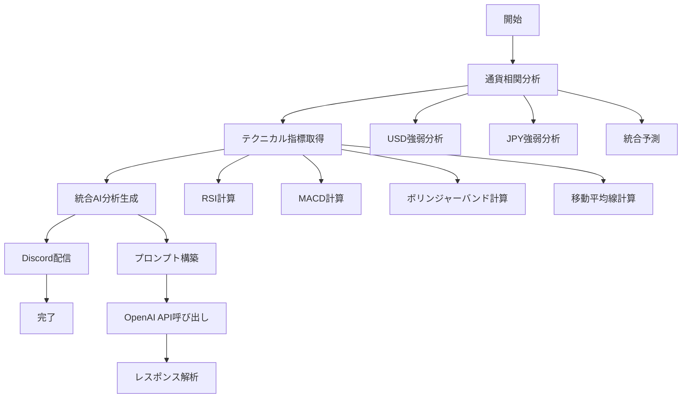

# AI 分析レポート仕様書

**旧ファイル名**: `AI分析レポート仕様書_2025.md`  

## 📋 **目次**

1. [システム概要](#システム概要)
2. [アーキテクチャ設計](#アーキテクチャ設計)
3. [AI 分析レポート機能](#ai分析レポート機能)
4. [テクニカル指標分析](#テクニカル指標分析)
5. [プロンプト仕様](#プロンプト仕様)
6. [API 仕様](#api仕様)
7. [CLI コマンド仕様](#cliコマンド仕様)
8. [データフロー](#データフロー)
9. [エラーハンドリング](#エラーハンドリング)
10. [今後の開発計画](#今後の開発計画)

---

## 🎯 **システム概要**

### **目的**

為替市場の実データを取得し、OpenAI GPT を使用して AI 分析レポートを生成し、Discord に自動配信する統合システム

### **主要機能**

- **実データ取得**: Yahoo Finance API からリアルタイム為替データ取得
- **テクニカル分析**: RSI、MACD、ボリンジャーバンド、移動平均線の計算
- **通貨相関分析**: 複数通貨ペアの相関関係分析
- **AI 分析生成**: OpenAI GPT-4/GPT-3.5-turbo による市場分析
- **自動配信**: Discord Webhook 経由での自動配信
- **マルチタイムフレーム**: D1、H4、H1、M5 の時間軸分析

### **対象通貨ペア**

- USD/JPY（メイン）
- EUR/USD
- GBP/USD
- EUR/JPY
- GBP/JPY

---

## 🏗️ **アーキテクチャ設計**

### **レイヤー構造**

```
┌─────────────────────────────────────┐
│           Presentation Layer        │
│  ┌─────────────┐ ┌─────────────┐   │
│  │   CLI       │ │   REST API  │   │
│  │ Commands    │ │   Routes    │   │
│  └─────────────┘ └─────────────┘   │
└─────────────────────────────────────┘
┌─────────────────────────────────────┐
│         Application Layer           │
│  ┌─────────────┐ ┌─────────────┐   │
│  │ Commands    │ │  Handlers   │   │
│  │ Services    │ │   DTOs      │   │
│  └─────────────┘ └─────────────┘   │
└─────────────────────────────────────┘
┌─────────────────────────────────────┐
│         Infrastructure Layer        │
│  ┌─────────────┐ ┌─────────────┐   │
│  │ External    │ │  Analysis   │   │
│  │ APIs        │ │  Engines    │   │
│  └─────────────┘ └─────────────┘   │
└─────────────────────────────────────┘
```

### **主要コンポーネント**

#### **1. プレゼンテーション層**

- `src/presentation/cli/commands/ai_commands.py` - CLI コマンド
- `src/presentation/api/routes/ai_reports.py` - REST API

#### **2. アプリケーション層**

- `src/application/commands/generate_report_command.py` - レポート生成コマンド
- `src/application/handlers/` - ビジネスロジックハンドラー

#### **3. インフラストラクチャ層**

- `src/infrastructure/external_apis/openai_client.py` - OpenAI API クライアント
- `src/infrastructure/analysis/technical_indicators.py` - テクニカル指標分析
- `src/infrastructure/analysis/currency_correlation_analyzer.py` - 通貨相関分析

#### **4. 実行スクリプト**

- `scripts/cron/integrated_ai_discord.py` - メイン統合スクリプト
- `scripts/cron/real_ai_discord_v2.py` - 実データ版 AI 分析

---

## 🤖 **AI 分析レポート機能**

### **レポート種別**

#### **1. 日次サマリー (daily_summary)**

- **目的**: 1 日の価格変動と明日の見通し
- **対象期間**: 過去 24 時間
- **分析内容**: 主要価格変動、ボラティリティ、マーケットトレンド

#### **2. 週次分析 (weekly_analysis)**

- **目的**: 週間の市場動向と来週の展望
- **対象期間**: 過去 7 日間
- **分析内容**: 週間パフォーマンス、ニュース影響、来週展望

#### **3. テクニカル分析 (technical_analysis)**

- **目的**: テクニカル指標に基づく分析
- **対象期間**: 過去 7-30 日間
- **分析内容**: テクニカル指標、サポート・レジスタンス、チャートパターン

#### **4. ファンダメンタル分析 (fundamental_analysis)**

- **目的**: 経済指標と政策要因の分析
- **対象期間**: 過去 30 日間
- **分析内容**: 経済指標、中央銀行政策、地政学的要因

#### **5. マーケット展望 (market_outlook)**

- **目的**: 中期的な市場展望
- **対象期間**: 過去 30-90 日間
- **分析内容**: 中期トレンド、リスク要因、投資機会

#### **6. カスタムレポート (custom)**

- **目的**: ユーザー指定の分析
- **対象期間**: カスタム指定
- **分析内容**: カスタムプロンプトによる分析

### **レポート形式**

#### **1. Markdown 形式 (デフォルト)**

```markdown
# USD/JPY 日次分析レポート

## 📊 市場概況

現在の USD/JPY 市場は...

## 📈 テクニカル分析

- RSI: 65.23 (neutral)
- MACD: 0.001234 (golden_cross)
- 移動平均: 20:147.1234 | 50:146.9876 | 200:146.5432

## 🎯 推奨アクション

- エントリー価格: 147.0000〜147.1000
- 利確目標: 147.5000（50pips）
- 損切り価格: 146.8000（20pips）
```

#### **2. HTML 形式**

- 構造化された HTML 出力
- スタイリング対応

#### **3. JSON 形式**

- 機械処理用の構造化データ
- API 連携対応

#### **4. プレーンテキスト**

- シンプルなテキスト出力
- 通知用

### **レポート言語**

- **日本語** (デフォルト)
- **英語**

---

## 📊 **テクニカル指標分析**

### **実装済み指標**

#### **1. RSI (Relative Strength Index)**

```python
{
    "indicator": "RSI",
    "timeframe": "D1",
    "period": 14,
    "current_value": 65.23,
    "previous_value": 62.15,
    "state": "neutral",           # overbought/neutral/oversold
    "signal": "buy_signal",       # buy_signal/sell_signal/neutral
    "divergence": "no_divergence", # bullish_divergence/bearish_divergence
    "levels": {"overbought": 70, "neutral": 50, "oversold": 30}
}
```

#### **2. MACD (Moving Average Convergence Divergence)**

```python
{
    "indicator": "MACD",
    "timeframe": "D1",
    "parameters": "12,26,9",
    "macd_line": 0.001234,
    "signal_line": 0.000987,
    "histogram": 0.000247,
    "cross_signal": "golden_cross",    # golden_cross/dead_cross/no_cross
    "zero_line_position": "above"      # above/below/neutral
}
```

#### **3. ボリンジャーバンド (Bollinger Bands)**

```python
{
    "indicator": "Bollinger Bands",
    "timeframe": "H4",
    "parameters": "BB(20,2)",
    "current_price": 147.2345,
    "upper_band": 148.1234,
    "middle_band": 147.5678,
    "lower_band": 147.0123,
    "band_position": "above_middle",   # above_upper/above_middle/below_middle/below_lower
    "band_walk": "no_band_walk",       # upper_band_walk/lower_band_walk
    "band_width_percent": 1.51
}
```

#### **4. 移動平均線 (Moving Averages)**

##### **時間軸別の移動平均線戦略**

| 時間軸 | 使用期間    | 目的                 | 分析内容                                         |
| ------ | ----------- | -------------------- | ------------------------------------------------ |
| **D1** | MA200, MA50 | 長期トレンド判断     | 大局的な方向性、長期サポート・レジスタンス       |
| **H4** | MA50, MA20  | 中期トレンド判断     | エントリーゾーン、中期トレンド確認               |
| **H1** | MA20        | 短期トレンド判断     | 短期サポート・レジスタンス、エントリータイミング |
| **M5** | MA20        | エントリータイミング | 精密な入り時、短期トレンド確認                   |

##### **データ構造**

```python
# 単一期間指定の場合（時間軸別戦略用）
{
    "indicator": "Moving Average (SMA)",
    "timeframe": "D1",
    "parameters": "SMA(200)",
    "current_price": 148.1990,
    "ma_200": 149.4779,
    "ma_position": "downtrend",  # uptrend/downtrend/neutral
    "ma_slope": "falling",       # rising/falling/flat
    "timestamp": "2025-08-12T07:55:53+09:00",
    "data_points": 258
}

# 3期間同時計算の場合（従来方式）
{
    "indicator": "Moving Averages",
    "timeframe": "D1",
    "parameters": "MA(20,50,200)",
    "current_price": 148.1990,
    "ma_short": 147.1234,      # 20期間
    "ma_medium": 145.9920,     # 50期間
    "ma_long": 149.4779,       # 200期間
    "ma_position": "uptrend",  # strong_uptrend/uptrend/strong_downtrend/downtrend/sideways
    "ma_slope": {
        "short_slope": "up",
        "medium_slope": "up",
        "long_slope": "down",
        "trend_alignment": "mixed"
    },
    "cross_signals": {
        "short_medium": "golden_cross",
        "medium_long": "dead_cross",
        "short_long": "no_cross"
    },
    "support_resistance": {
        "ma_20": 147.1234,
        "ma_50": 145.9920,
        "ma_200": 149.4779
    }
}
```

##### **実装詳細**

- **計算方法**: SMA（単純移動平均）と EMA（指数移動平均）に対応
- **期間指定**: 任意の期間を指定可能（20, 50, 200 など）
- **データ要件**: 指定期間 + 10 件のデータが必要
- **エラーハンドリング**: データ不足時の適切なエラーメッセージ
- **位置分析**: 現在価格と移動平均線の位置関係
- **傾き分析**: 線形回帰による移動平均線の傾き計算

### **マルチタイムフレーム分析**

#### **時間軸別の役割と移動平均線戦略**

| 時間軸 | 目的       | 使用指標  | 移動平均線  | 分析内容                                     |
| ------ | ---------- | --------- | ----------- | -------------------------------------------- |
| **D1** | 大局判断   | RSI, MACD | MA200, MA50 | 長期トレンド方向、長期サポート・レジスタンス |
| **H4** | 戦術判断   | RSI, BB   | MA50, MA20  | 中期トレンド、エントリーゾーン特定           |
| **H1** | ゾーン決定 | RSI, BB   | MA20        | 短期トレンド、具体的なエントリーゾーン       |
| **M5** | タイミング | RSI       | MA20        | 精密なエントリータイミング、短期トレンド確認 |

#### **データ取得期間設定**

```python
timeframes = {
    "D1": ("1y", "1d"),   # 1年、日足（MA200計算のため）
    "H4": ("1mo", "1h"),  # 1ヶ月、1時間足
    "H1": ("1wk", "1h"),  # 1週間、1時間足
    "M5": ("3d", "5m"),   # 3日、5分足
}
```

#### **総合シグナル生成**

```python
{
    "direction": "bullish",      # bullish/bearish/neutral
    "signal_count": 3,
    "buy_signals": 2,
    "sell_signals": 1,
    "confidence": 20             # 0-100%
}
```

---

## 📝 **プロンプト仕様**

### **基本プロンプト構造**

#### **1. システムメッセージ**

```
あなたは経験豊富なプロFXトレーダーかつ親切な投資教育者です。
FX初学者にも理解できるよう、専門用語には必ず説明を付けながら、
通貨間の相関性とテクニカル指標を活用した統合分析に基づいて、
USD/JPY の実践的な売買シナリオを作成してください。
```

#### **2. 市場データセクション**

```
【統合相関分析結果】
分析時刻: 2025年1月XX日 XX:XX JST

◆ USD/JPY メイン通貨ペア
現在レート: 147.2345
変動: +0.15 (+0.10%)
日中高値: 147.3500
日中安値: 147.1000

◆ USD強弱分析
方向性: 強気 (信頼度85%)
サポート要因: EUR/USD, GBP/USD
リスク要因: EUR/JPY

◆ JPY強弱分析
方向性: 弱気 (信頼度78%)
サポート要因: EUR/JPY, GBP/JPY
リスク要因: USD/JPY

◆ 統合予測
予測方向: 上昇 (信頼度82%)
戦略バイアス: 買い
トレンド整合: 整合
相関要因: USD強気, JPY弱気
```

#### **3. テクニカル指標セクション**

```
【USD/JPYテクニカル指標】
D1_RSI: 54.5 (neutral)
D1_MACD: MACD=0.4380, Signal=0.6172, Cross=dead_cross
D1_MA_LONG: MA200=149.4779 (downtrend)
D1_MA_MEDIUM: MA50=145.9920 (uptrend)
H4_RSI: 66.0 (neutral)
H4_BB: above_middle (no_band_walk)
H4_MA_MEDIUM: MA50=147.6205 (uptrend)
H4_MA_SHORT: MA20=147.8381 (uptrend)
H1_RSI: 66.0 (neutral)
H1_BB: above_middle (no_band_walk)
H1_MA_SHORT: MA20=147.8381 (uptrend)
M5_RSI: 58.6 (neutral)
M5_MA_SHORT: MA20=148.1471 (uptrend)
```

#### **4. 戦略要求セクション**

```
【戦略要求】
上記の通貨相関分析とテクニカル指標を踏まえ、以下の形式で1024文字以内の売買シナリオを作成。
その際、移動平均線からのサポートラインやレジスタンスラインを考慮してください。
売買の際には押し目での売り買いを考慮してください。
レポートの中では特に数値を示すと評価が高くなります。
情報の優先順位はテクニカル指標・分析＞通貨の相関関係です。
また、テクニカル指標の数値は具体的に示してください。
pipsは0.01円=1pipです。
価格は○○.○○○のように具体的な3桁価格で示してください。

【相関分析】他通貨の動きから見るUSD/JPY方向性
【大局観】D1・H4マルチタイムフレーム分析（※テクニカル指標含む）
  - D1: 長期トレンド（MA200、MA50）、MACD、RSI
  - H4: 中期トレンド（MA50、MA20）、ボリンジャーバンド
【戦術】H1エントリーゾーン・タイミング分析
  - H1: 短期トレンド（MA20）、RSI、ボリンジャーバンド
【タイミング】M5エントリーポイント
  - M5: 短期トレンド（MA20）、RSI
【統合シナリオ】相関性とテクニカル指標を考慮した売買戦略・具体的価格指示
 ・エントリー価格: ○○.○○○〜○○.○○○
 ・利確目標: ○○.○○○（〇〇〜〇〇pips※利益）
 ・損切り価格: ○○.○○○（〇〇pips※損失）
 サポートライン（○○.○○○）やレジスタンスライン（○○.○○○）を明確にした利確、または損切りの根拠や理由を明記してください。
【リスク管理】通貨相関リスク・ダイバージェンス、サポートラインや抵抗線、揉み合いによる反転※警戒

※専門用語解説：
・pips: 通貨ペアの最小価格単位（USD/JPYなら0.01円=1pip）
・ダイバージェンス: 価格とテクニカル指標の動きが逆行する現象
・移動平均線: 過去の価格の平均値を示すトレンド指標
・その他専門用語があれば簡潔に説明

「EUR/USDがこうだから」「クロス円がこうだから」「テクニカル指標がこうだから」「だからUSD/JPYはこう動く可能性が高い」という統合的で根拠のある分析を重視し、必ず具体的な価格（小数点以下3桁）とpips数を明記してください。
```

### **レポート種別別プロンプト**

#### **日次サマリー**

```
以下のデータを基に日次市場サマリーレポートを作成してください。
主要な価格変動、ボラティリティ、マーケットトレンドを分析し、
明日の見通しを含めてください。
```

#### **週次分析**

```
以下のデータを基に週次分析レポートを作成してください。
週間の価格パフォーマンス、重要なニュースイベントの影響、
来週の展望を含めてください。
```

#### **テクニカル分析**

```
以下のデータを基にテクニカル分析レポートを作成してください。
主要なテクニカル指標、サポート・レジスタンスレベル、
チャートパターンを分析してください。
```

### **プロンプト最適化設定**

#### **Temperature 設定**

- **デフォルト**: 0.7
- **範囲**: 0.0 - 2.0
- **低い値**: より一貫性のある分析
- **高い値**: より創造的な分析

#### **トークン制限**

- **最大トークン**: 2000
- **推奨文字数**: 1024 文字以内
- **日本語**: 約 2 文字 = 1 トークン
- **英語**: 約 4 文字 = 1 トークン

---

## 🔌 **API 仕様**

### **REST API エンドポイント**

#### **1. AI 分析レポート生成**

```http
POST /api/v1/ai-reports/generate
Content-Type: application/json

{
    "currency_pair": "USD/JPY",
    "report_type": "daily_summary",
    "analysis_period": "1d",
    "include_technical_indicators": true,
    "include_correlation_analysis": true,
    "language": "ja",
    "format": "markdown"
}
```

**レスポンス**

```json
{
    "success": true,
    "data": {
        "report_id": "ai_report_001",
        "title": "USD/JPY 市場分析レポート",
        "content": "現在のUSD/JPY市場は上昇トレンドを示しており...",
        "confidence_score": 0.85,
        "generated_at": "2025-01-XXTXX:XX:XXZ",
        "model": "gpt-4",
        "technical_indicators": {...},
        "correlation_analysis": {...}
    },
    "timestamp": "2025-01-XXTXX:XX:XXZ"
}
```

#### **2. AI 分析レポート一覧取得**

```http
GET /api/v1/ai-reports?limit=10&currency_pair=USD/JPY
```

**レスポンス**

```json
{
  "success": true,
  "data": {
    "reports": [
      {
        "report_id": "ai_report_001",
        "title": "USD/JPY 日次分析",
        "summary": "上昇トレンド継続中",
        "confidence_score": 0.85,
        "generated_at": "2025-01-XXTXX:XX:XXZ"
      }
    ],
    "total": 1
  },
  "timestamp": "2025-01-XXTXX:XX:XXZ"
}
```

### **エラーレスポンス**

```json
{
  "success": false,
  "error": {
    "code": "INSUFFICIENT_DATA",
    "message": "データ不足（210件必要）",
    "details": "移動平均線計算に必要なデータが不足しています"
  },
  "timestamp": "2025-01-XXTXX:XX:XXZ"
}
```

---

## 💻 **CLI コマンド仕様**

### **メインコマンド**

```bash
exchange-analytics ai [COMMAND] [OPTIONS]
```

### **コマンド一覧**

#### **1. AI 分析実行**

```bash
exchange-analytics ai analyze [CURRENCY_PAIR] [OPTIONS]
```

**オプション**

- `--period, -p`: 分析期間 (1h, 1d, 1w, 1m) [デフォルト: 1d]
- `--discord/--no-discord`: Discord 通知送信 [デフォルト: true]
- `--real/--demo`: 実データ使用 [デフォルト: true]
- `--force, -f`: 確認をスキップ

**使用例**

```bash
# 基本分析
exchange-analytics ai analyze USD/JPY

# 週次分析
exchange-analytics ai analyze EUR/USD --period 1w

# Discord通知なし
exchange-analytics ai analyze GBP/JPY --no-discord

# 強制実行
exchange-analytics ai analyze USD/JPY --force
```

#### **2. レポート一覧表示**

```bash
exchange-analytics ai reports [OPTIONS]
```

**オプション**

- `--limit, -n`: 表示件数 [デフォルト: 10]
- `--pair, -p`: 通貨ペアフィルタ

**使用例**

```bash
# 基本表示
exchange-analytics ai reports

# 最新5件
exchange-analytics ai reports --limit 5

# USD/JPYのみ
exchange-analytics ai reports --pair USD/JPY
```

#### **3. Discord 通知テスト**

```bash
exchange-analytics ai discord-test
```

#### **4. 定期スケジュール設定**

```bash
exchange-analytics ai schedule [OPTIONS]
```

**オプション**

- `--pairs, -p`: 通貨ペア (カンマ区切り) [デフォルト: USD/JPY,EUR/USD]
- `--interval, -i`: 実行間隔 (秒) [デフォルト: 3600]
- `--period`: 分析期間 [デフォルト: 1d]
- `--discord/--no-discord`: Discord 通知 [デフォルト: true]

**使用例**

```bash
# 基本スケジュール
exchange-analytics ai schedule

# 複数通貨ペア
exchange-analytics ai schedule --pairs "USD/JPY,EUR/USD,GBP/JPY"

# 2時間間隔
exchange-analytics ai schedule --interval 7200 --period 1w
```

---

## 🔄 **データフロー**

### **統合 AI 分析フロー**



### **詳細データフロー**

#### **1. データ取得フェーズ**

```
Yahoo Finance API → 価格データ → データ検証 → データベース保存
```

#### **2. 分析フェーズ**

```
価格データ → テクニカル指標計算 → 相関分析 → 統合分析
```

#### **3. AI 生成フェーズ**

```
分析結果 → プロンプト構築 → OpenAI API → レスポンス解析 → レポート生成
```

#### **4. 配信フェーズ**

```
レポート → Discord Webhook → 配信確認 → 履歴保存
```

### **データ依存関係**

#### **最小データ要件**

| 指標          | 必要期間 | 最小データ数 |
| ------------- | -------- | ------------ |
| RSI(14)       | 14 期間  | 20 件        |
| MACD(12,26,9) | 26 期間  | 35 件        |
| BB(20,2)      | 20 期間  | 25 件        |
| MA(20,50,200) | 200 期間 | 210 件       |

#### **推奨データ量**

- **短期分析**: 過去 30 日分
- **中期分析**: 過去 90 日分
- **長期分析**: 過去 200 日分

---

## ⚠️ **エラーハンドリング**

### **エラー分類**

#### **1. データエラー**

```python
{
    "error": "データ不足（210件必要）",
    "type": "INSUFFICIENT_DATA",
    "required": 210,
    "available": 150
}
```

#### **2. API エラー**

```python
{
    "error": "OpenAI API呼び出し失敗",
    "type": "API_ERROR",
    "status_code": 429,
    "message": "Rate limit exceeded"
}
```

#### **3. ネットワークエラー**

```python
{
    "error": "ネットワーク接続エラー",
    "type": "NETWORK_ERROR",
    "timeout": 30.0,
    "retry_count": 3
}
```

#### **4. データ形式エラー**

```python
{
    "error": "データ形式エラー: DataFrameが必要",
    "type": "DATA_FORMAT_ERROR",
    "expected": "pandas.DataFrame",
    "received": "numpy.ndarray"
}
```

### **エラー処理戦略**

#### **1. リトライ戦略**

- **最大リトライ回数**: 3 回
- **バックオフ間隔**: 指数バックオフ（1s, 2s, 4s）
- **対象エラー**: ネットワークエラー、一時的 API エラー

#### **2. フォールバック戦略**

- **データ不足時**: サンプルデータ使用
- **API 失敗時**: キャッシュデータ使用
- **分析失敗時**: 基本分析のみ実行

#### **3. エラー通知**

- **Discord 通知**: エラー詳細を Discord に送信
- **ログ記録**: 詳細エラーログをファイルに記録
- **監視**: エラー率の監視とアラート

### **エラー回復**

#### **1. 自動回復**

```python
# データ不足時の自動データ取得
if len(data) < required_periods:
    await self._fetch_additional_data(required_periods - len(data))
```

#### **2. 手動回復**

```bash
# データ再取得
exchange-analytics data fetch USD/JPY --period 30d

# 分析再実行
exchange-analytics ai analyze USD/JPY --force
```

---

## 🚀 **今後の開発計画**

### **Phase 1: 機能拡張（2025 年 Q1）**

#### **1. 追加テクニカル指標**

- **ストキャスティクス**: %K, %D, 期間 14
- **ATR (Average True Range)**: ボラティリティ測定
- **フィボナッチリトレースメント**: サポート・レジスタンス
- **ピボットポイント**: 日次・週次・月次

#### **2. 高度な分析機能**

- **パターン認識**: チャートパターン自動検出
- **エリオット波動**: 波動分析
- **市場センチメント**: ニュース・ソーシャルメディア分析
- **経済カレンダー**: 重要イベントの影響分析

#### **3. 機械学習統合**

- **予測モデル**: 価格予測の精度向上
- **異常検出**: 異常な価格変動の検出
- **最適化**: パラメータの自動最適化

### **Phase 2: プラットフォーム拡張（2025 年 Q2）**

#### **1. マルチアセット対応**

- **株式**: 主要株価指数、個別銘柄
- **暗号通貨**: Bitcoin, Ethereum 等
- **商品**: 金、原油等

#### **2. 高度な通知システム**

- **メール通知**: SMTP 経由でのメール配信
- **Slack 連携**: Slack Webhook 対応
- **LINE 通知**: LINE Messaging API 対応
- **プッシュ通知**: モバイルアプリ対応

#### **3. Web ダッシュボード**

- **リアルタイム表示**: WebSocket 経由のリアルタイム更新
- **インタラクティブチャート**: チャート操作機能
- **履歴表示**: 過去レポートの閲覧・検索
- **設定画面**: パラメータ調整機能

### **Phase 3: エンタープライズ機能（2025 年 Q3）**

#### **1. マルチユーザー対応**

- **ユーザー管理**: 認証・認可システム
- **権限管理**: ロールベースアクセス制御
- **課金システム**: サブスクリプション管理

#### **2. 高度な分析機能**

- **バックテスト**: 戦略の過去データ検証
- **リスク管理**: VaR, 最大ドローダウン計算
- **ポートフォリオ分析**: 複数資産の統合分析

#### **3. API 拡張**

- **GraphQL API**: 柔軟なデータ取得
- **Webhook**: リアルタイムイベント通知
- **SDK**: 各種言語の SDK 提供

### **Phase 4: AI 高度化（2025 年 Q4）**

#### **1. 大規模言語モデル統合**

- **Claude API**: Anthropic Claude 統合
- **Gemini API**: Google Gemini 統合
- **マルチモデル**: 複数 AI モデルの比較・選択

#### **2. 高度な AI 機能**

- **感情分析**: ニュース・ソーシャルメディアの感情分析
- **要約機能**: 長文レポートの自動要約
- **翻訳機能**: 多言語対応

#### **3. パーソナライゼーション**

- **ユーザープロファイル**: 個人の投資スタイル学習
- **カスタム戦略**: 個人向け戦略生成
- **推奨機能**: パーソナライズされた推奨

### **技術的改善**

#### **1. パフォーマンス最適化**

- **キャッシュ戦略**: Redis 統合
- **非同期処理**: Celery 統合
- **データベース最適化**: インデックス最適化

#### **2. スケーラビリティ**

- **マイクロサービス**: サービス分割
- **コンテナ化**: Docker/Kubernetes 対応
- **負荷分散**: ロードバランサー導入

#### **3. 監視・運用**

- **メトリクス収集**: Prometheus 統合
- **ログ管理**: ELK Stack 統合
- **アラート**: Grafana 統合

---

## 📚 **参考資料**

### **設計ドキュメント**

- `note/design_documents/基本設計書_20250809.md`
- `note/design_documents/詳細内部設計_20250809.md`
- `note/design_documents/アプリケーション層設計_20250809.md`
- `note/design_documents/プレゼンテーション層設計_20250809.md`

### **実装ファイル**

- `src/infrastructure/analysis/technical_indicators.py`
- `src/infrastructure/external_apis/openai_client.py`
- `src/application/commands/generate_report_command.py`
- `scripts/cron/integrated_ai_discord.py`

### **設定ファイル**

- `config/ai_analysis_config.yaml`
- `config/technical_indicators_config.yaml`
- `config/prompts_config.yaml`

---

## 📝 **更新履歴**

| 日付       | バージョン | 更新内容                   | 担当者       |
| ---------- | ---------- | -------------------------- | ------------ |
| 2025-01-XX | 1.0.0      | 初版作成                   | AI Assistant |
| 2025-01-XX | 1.1.0      | 移動平均線機能追加         | AI Assistant |
| 2025-01-XX | 1.2.0      | プロンプト最適化           | AI Assistant |
| 2025-08-12 | 1.3.0      | 時間軸別移動平均線戦略実装 | AI Assistant |

**主な更新内容（v1.3.0）:**

- 時間軸別の移動平均線戦略実装（D1: MA200/MA50, H4: MA50/MA20, H1: MA20, M5: MA20）
- 単一期間指定に対応した`calculate_moving_averages`メソッド拡張
- プロンプト改善（時間軸別分析フレームワーク、専門用語解説追加）
- データ取得期間最適化（MA200 計算のため D1 を 1 年分に拡張）
- 統合 AI 分析レポートの正常動作確認

---

**作成日**: 2025 年 1 月 XX 日
**最終更新**: 2025 年 1 月 XX 日
**バージョン**: 1.2.0
**作成者**: AI Assistant
