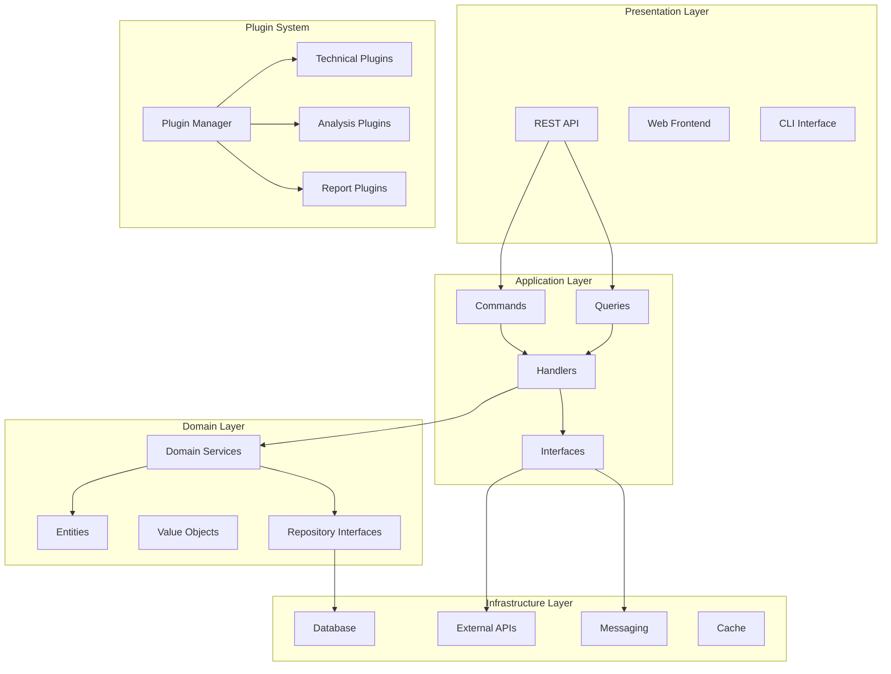

# 詳細内部設計書

**作成日**: 2025 年 8 月 9 日
**目的**: 各モジュールの内部構造とクラス設計の詳細化
**開発方針**: 独立開発可能なモジュール分割

## 1. アーキテクチャ全体図



## 2. Domain Layer 設計

### 2.1 Entities (エンティティ)

#### src/domain/entities/base.py

```python
"""基底エンティティクラス"""
from abc import ABC
from dataclasses import dataclass, field
from datetime import datetime
from typing import Optional, Any, Dict
import uuid

@dataclass
class BaseEntity(ABC):
    """全エンティティの基底クラス"""
    id: Optional[int] = None
    uuid: str = field(default_factory=lambda: str(uuid.uuid4()))
    created_at: Optional[datetime] = None
    updated_at: Optional[datetime] = None
    version: int = 1

    def __post_init__(self):
        if self.created_at is None:
            self.created_at = datetime.utcnow()
        self.updated_at = datetime.utcnow()

    def update_version(self):
        """バージョン更新"""
        self.version += 1
        self.updated_at = datetime.utcnow()

    def to_dict(self) -> Dict[str, Any]:
        """辞書変換"""
        return {
            'id': self.id,
            'uuid': self.uuid,
            'created_at': self.created_at.isoformat() if self.created_at else None,
            'updated_at': self.updated_at.isoformat() if self.updated_at else None,
            'version': self.version
        }
```

#### src/domain/entities/exchange_rate.py

```python
"""為替レートエンティティ"""
from dataclasses import dataclass
from datetime import datetime
from decimal import Decimal
from typing import Optional
from .base import BaseEntity

@dataclass
class ExchangeRate(BaseEntity):
    """為替レートエンティティ"""
    currency_pair: str
    timestamp: datetime
    open_price: Decimal
    high_price: Decimal
    low_price: Decimal
    close_price: Decimal
    volume: Optional[int] = None
    source: str = "unknown"

    def __post_init__(self):
        super().__post_init__()
        self._validate()

    def _validate(self):
        """データ検証"""
        if not self.currency_pair or len(self.currency_pair) != 6:
            raise ValueError("Invalid currency pair format")

        prices = [self.open_price, self.high_price, self.low_price, self.close_price]
        if any(price <= 0 for price in prices):
            raise ValueError("Prices must be positive")

        if self.high_price < max(self.open_price, self.close_price):
            raise ValueError("High price must be >= open/close price")

        if self.low_price > min(self.open_price, self.close_price):
            raise ValueError("Low price must be <= open/close price")

    def get_body_size(self) -> Decimal:
        """ローソク足の実体サイズ"""
        return abs(self.close_price - self.open_price)

    def get_upper_shadow(self) -> Decimal:
        """上ヒゲの長さ"""
        return self.high_price - max(self.open_price, self.close_price)

    def get_lower_shadow(self) -> Decimal:
        """下ヒゲの長さ"""
        return min(self.open_price, self.close_price) - self.low_price

    def is_bullish(self) -> bool:
        """陽線かどうか"""
        return self.close_price > self.open_price

    def to_dict(self) -> dict:
        """辞書変換（親のメソッドを拡張）"""
        base_dict = super().to_dict()
        base_dict.update({
            'currency_pair': self.currency_pair,
            'timestamp': self.timestamp.isoformat(),
            'open_price': str(self.open_price),
            'high_price': str(self.high_price),
            'low_price': str(self.low_price),
            'close_price': str(self.close_price),
            'volume': self.volume,
            'source': self.source
        })
        return base_dict
```

#### src/domain/entities/technical_indicator.py

```python
"""テクニカル指標エンティティ"""
from dataclasses import dataclass
from datetime import datetime
from decimal import Decimal
from typing import Optional, Dict, Any
from .base import BaseEntity

@dataclass
class TechnicalIndicator(BaseEntity):
    """テクニカル指標エンティティ"""
    currency_pair: str
    indicator_type: str  # "SMA", "RSI", "MACD", etc.
    timestamp: datetime
    value: Decimal
    parameters: Dict[str, Any]  # 指標計算時のパラメータ
    metadata: Optional[Dict[str, Any]] = None  # 追加メタデータ
    confidence: Optional[Decimal] = None  # 信頼度

    def __post_init__(self):
        super().__post_init__()
        self._validate()

    def _validate(self):
        """データ検証"""
        if not self.currency_pair:
            raise ValueError("Currency pair is required")

        if not self.indicator_type:
            raise ValueError("Indicator type is required")

        if not self.parameters:
            raise ValueError("Parameters are required")

    def get_signal_strength(self) -> str:
        """シグナル強度を取得"""
        if self.confidence is None:
            return "unknown"

        confidence_float = float(self.confidence)
        if confidence_float >= 0.8:
            return "strong"
        elif confidence_float >= 0.6:
            return "medium"
        elif confidence_float >= 0.4:
            return "weak"
        else:
            return "very_weak"

    def is_overbought(self) -> Optional[bool]:
        """買われすぎ状態かどうか（RSI等に適用）"""
        if self.indicator_type.upper() == "RSI":
            overbought_threshold = self.parameters.get('overbought_threshold', 70)
            return float(self.value) >= overbought_threshold
        return None

    def is_oversold(self) -> Optional[bool]:
        """売られすぎ状態かどうか（RSI等に適用）"""
        if self.indicator_type.upper() == "RSI":
            oversold_threshold = self.parameters.get('oversold_threshold', 30)
            return float(self.value) <= oversold_threshold
        return None

    def to_dict(self) -> dict:
        """辞書変換"""
        base_dict = super().to_dict()
        base_dict.update({
            'currency_pair': self.currency_pair,
            'indicator_type': self.indicator_type,
            'timestamp': self.timestamp.isoformat(),
            'value': str(self.value),
            'parameters': self.parameters,
            'metadata': self.metadata,
            'confidence': str(self.confidence) if self.confidence else None
        })
        return base_dict
```

#### src/domain/entities/analysis_report.py

```python
"""AI分析レポートエンティティ"""
from dataclasses import dataclass
from datetime import datetime, date
from decimal import Decimal
from typing import Optional, List, Dict, Any
from enum import Enum
from .base import BaseEntity

class ReportType(Enum):
    """レポート種別"""
    DAILY = "daily"
    WEEKLY = "weekly"
    EVENT_DRIVEN = "event_driven"
    CUSTOM = "custom"

class ReportStatus(Enum):
    """レポート状態"""
    DRAFT = "draft"
    GENERATED = "generated"
    SENT = "sent"
    FAILED = "failed"

@dataclass
class AnalysisReport(BaseEntity):
    """AI分析レポートエンティティ"""
    report_date: date
    report_type: ReportType
    status: ReportStatus
    title: str
    market_summary: str
    technical_analysis: str
    fundamental_analysis: Optional[str] = None
    recommendations: Optional[str] = None
    currency_pairs_analyzed: List[str] = None
    confidence_score: Optional[Decimal] = None
    ai_model_used: str = "gpt-4"
    prompt_version: str = "v1.0"
    generation_time_seconds: Optional[float] = None
    discord_message_id: Optional[str] = None
    error_message: Optional[str] = None

    def __post_init__(self):
        super().__post_init__()
        if self.currency_pairs_analyzed is None:
            self.currency_pairs_analyzed = []
        self._validate()

    def _validate(self):
        """データ検証"""
        if not self.title:
            raise ValueError("Title is required")

        if not self.market_summary:
            raise ValueError("Market summary is required")

        if not self.technical_analysis:
            raise ValueError("Technical analysis is required")

        if self.confidence_score and not (0 <= self.confidence_score <= 1):
            raise ValueError("Confidence score must be between 0 and 1")

    def mark_as_sent(self, discord_message_id: str):
        """送信完了としてマーク"""
        self.status = ReportStatus.SENT
        self.discord_message_id = discord_message_id
        self.update_version()

    def mark_as_failed(self, error_message: str):
        """失敗としてマーク"""
        self.status = ReportStatus.FAILED
        self.error_message = error_message
        self.update_version()

    def get_total_content_length(self) -> int:
        """総コンテンツ長を取得"""
        content_parts = [
            self.market_summary,
            self.technical_analysis,
            self.fundamental_analysis or "",
            self.recommendations or ""
        ]
        return sum(len(part) for part in content_parts)

    def is_suitable_for_discord(self) -> bool:
        """Discord配信に適しているかチェック"""
        # Discord Embedの制限: 6000文字
        return self.get_total_content_length() <= 5500  # 余裕を持たせる

    def to_dict(self) -> dict:
        """辞書変換"""
        base_dict = super().to_dict()
        base_dict.update({
            'report_date': self.report_date.isoformat(),
            'report_type': self.report_type.value,
            'status': self.status.value,
            'title': self.title,
            'market_summary': self.market_summary,
            'technical_analysis': self.technical_analysis,
            'fundamental_analysis': self.fundamental_analysis,
            'recommendations': self.recommendations,
            'currency_pairs_analyzed': self.currency_pairs_analyzed,
            'confidence_score': str(self.confidence_score) if self.confidence_score else None,
            'ai_model_used': self.ai_model_used,
            'prompt_version': self.prompt_version,
            'generation_time_seconds': self.generation_time_seconds,
            'discord_message_id': self.discord_message_id,
            'error_message': self.error_message
        })
        return base_dict
```

### 2.2 Value Objects (値オブジェクト)

#### src/domain/value_objects/currency_pair.py

```python
"""通貨ペア値オブジェクト"""
from dataclasses import dataclass
from typing import Tuple
import re

@dataclass(frozen=True)
class CurrencyPair:
    """通貨ペア値オブジェクト"""
    base_currency: str
    quote_currency: str

    def __post_init__(self):
        self._validate()

    def _validate(self):
        """バリデーション"""
        currency_pattern = re.compile(r'^[A-Z]{3}$')

        if not currency_pattern.match(self.base_currency):
            raise ValueError(f"Invalid base currency: {self.base_currency}")

        if not currency_pattern.match(self.quote_currency):
            raise ValueError(f"Invalid quote currency: {self.quote_currency}")

        if self.base_currency == self.quote_currency:
            raise ValueError("Base and quote currencies cannot be the same")

    def to_string(self) -> str:
        """文字列表現"""
        return f"{self.base_currency}/{self.quote_currency}"

    def to_string_no_slash(self) -> str:
        """スラッシュなし文字列表現"""
        return f"{self.base_currency}{self.quote_currency}"

    def reverse(self) -> 'CurrencyPair':
        """逆ペアを取得"""
        return CurrencyPair(self.quote_currency, self.base_currency)

    def is_major_pair(self) -> bool:
        """主要通貨ペアかどうか"""
        major_pairs = {
            "EUR/USD", "GBP/USD", "USD/JPY", "USD/CHF",
            "AUD/USD", "USD/CAD", "NZD/USD"
        }
        return self.to_string() in major_pairs

    def is_yen_pair(self) -> bool:
        """円ペアかどうか"""
        return self.quote_currency == "JPY"

    @classmethod
    def from_string(cls, pair_string: str) -> 'CurrencyPair':
        """文字列から作成"""
        if '/' in pair_string:
            parts = pair_string.split('/')
        elif len(pair_string) == 6:
            parts = [pair_string[:3], pair_string[3:]]
        else:
            raise ValueError(f"Invalid currency pair format: {pair_string}")

        if len(parts) != 2:
            raise ValueError(f"Invalid currency pair format: {pair_string}")

        return cls(parts[0].upper(), parts[1].upper())
```

#### src/domain/value_objects/price.py

```python
"""価格値オブジェクト"""
from dataclasses import dataclass
from decimal import Decimal, ROUND_HALF_UP
from typing import Union

@dataclass(frozen=True)
class Price:
    """価格値オブジェクト"""
    value: Decimal
    currency: str
    precision: int = 5  # 小数点以下桁数

    def __post_init__(self):
        # Decimalでない場合は変換
        if not isinstance(self.value, Decimal):
            object.__setattr__(self, 'value', Decimal(str(self.value)))

        self._validate()

    def _validate(self):
        """バリデーション"""
        if self.value <= 0:
            raise ValueError("Price must be positive")

        if not self.currency or len(self.currency) != 3:
            raise ValueError("Currency must be 3 characters")

        if self.precision < 0 or self.precision > 10:
            raise ValueError("Precision must be between 0 and 10")

    def round_to_precision(self) -> 'Price':
        """指定精度に丸める"""
        rounded_value = self.value.quantize(
            Decimal('0.1') ** self.precision,
            rounding=ROUND_HALF_UP
        )
        return Price(rounded_value, self.currency, self.precision)

    def add(self, other: Union['Price', Decimal, float, int]) -> 'Price':
        """加算"""
        if isinstance(other, Price):
            if other.currency != self.currency:
                raise ValueError("Cannot add prices with different currencies")
            new_value = self.value + other.value
        else:
            new_value = self.value + Decimal(str(other))

        return Price(new_value, self.currency, self.precision)

    def subtract(self, other: Union['Price', Decimal, float, int]) -> 'Price':
        """減算"""
        if isinstance(other, Price):
            if other.currency != self.currency:
                raise ValueError("Cannot subtract prices with different currencies")
            new_value = self.value - other.value
        else:
            new_value = self.value - Decimal(str(other))

        if new_value <= 0:
            raise ValueError("Result must be positive")

        return Price(new_value, self.currency, self.precision)

    def multiply(self, factor: Union[Decimal, float, int]) -> 'Price':
        """乗算"""
        new_value = self.value * Decimal(str(factor))
        if new_value <= 0:
            raise ValueError("Result must be positive")

        return Price(new_value, self.currency, self.precision)

    def divide(self, divisor: Union[Decimal, float, int]) -> 'Price':
        """除算"""
        if divisor == 0:
            raise ValueError("Cannot divide by zero")

        new_value = self.value / Decimal(str(divisor))
        if new_value <= 0:
            raise ValueError("Result must be positive")

        return Price(new_value, self.currency, self.precision)

    def percentage_change(self, other: 'Price') -> Decimal:
        """変化率計算"""
        if other.currency != self.currency:
            raise ValueError("Cannot calculate percentage change with different currencies")

        return ((self.value - other.value) / other.value) * 100

    def __str__(self) -> str:
        return f"{self.value:.{self.precision}f} {self.currency}"

    def __eq__(self, other) -> bool:
        if not isinstance(other, Price):
            return False
        return (self.value == other.value and
                self.currency == other.currency)

    def __lt__(self, other: 'Price') -> bool:
        if other.currency != self.currency:
            raise ValueError("Cannot compare prices with different currencies")
        return self.value < other.value

    def __le__(self, other: 'Price') -> bool:
        if other.currency != self.currency:
            raise ValueError("Cannot compare prices with different currencies")
        return self.value <= other.value

    def __gt__(self, other: 'Price') -> bool:
        if other.currency != self.currency:
            raise ValueError("Cannot compare prices with different currencies")
        return self.value > other.value

    def __ge__(self, other: 'Price') -> bool:
        if other.currency != self.currency:
            raise ValueError("Cannot compare prices with different currencies")
        return self.value >= other.value
```

### 2.3 Repository Interfaces (リポジトリインターフェース)

#### src/domain/repositories/base.py

```python
"""ベースリポジトリインターフェース"""
from abc import ABC, abstractmethod
from typing import Optional, List, Dict, Any, TypeVar, Generic
from datetime import datetime

T = TypeVar('T')

class BaseRepository(ABC, Generic[T]):
    """ベースリポジトリインターフェース"""

    @abstractmethod
    async def find_by_id(self, entity_id: int) -> Optional[T]:
        """IDで検索"""
        pass

    @abstractmethod
    async def find_by_uuid(self, uuid: str) -> Optional[T]:
        """UUIDで検索"""
        pass

    @abstractmethod
    async def find_all(self, limit: int = 100, offset: int = 0) -> List[T]:
        """全件検索"""
        pass

    @abstractmethod
    async def save(self, entity: T) -> T:
        """保存"""
        pass

    @abstractmethod
    async def update(self, entity: T) -> T:
        """更新"""
        pass

    @abstractmethod
    async def delete(self, entity_id: int) -> bool:
        """削除"""
        pass

    @abstractmethod
    async def exists(self, entity_id: int) -> bool:
        """存在確認"""
        pass

    @abstractmethod
    async def count(self, filters: Optional[Dict[str, Any]] = None) -> int:
        """件数カウント"""
        pass
```

#### src/domain/repositories/exchange_rate_repository.py

```python
"""為替レートリポジトリインターフェース"""
from abc import abstractmethod
from typing import List, Optional
from datetime import datetime, date
from ..entities.exchange_rate import ExchangeRate
from ..value_objects.currency_pair import CurrencyPair
from .base import BaseRepository

class ExchangeRateRepository(BaseRepository[ExchangeRate]):
    """為替レートリポジトリインターフェース"""

    @abstractmethod
    async def find_by_currency_pair(
        self,
        currency_pair: CurrencyPair,
        limit: int = 100
    ) -> List[ExchangeRate]:
        """通貨ペアで検索"""
        pass

    @abstractmethod
    async def find_by_currency_pair_and_date_range(
        self,
        currency_pair: CurrencyPair,
        start_date: datetime,
        end_date: datetime
    ) -> List[ExchangeRate]:
        """通貨ペアと日付範囲で検索"""
        pass

    @abstractmethod
    async def find_latest_by_currency_pair(
        self,
        currency_pair: CurrencyPair
    ) -> Optional[ExchangeRate]:
        """通貨ペアの最新レート取得"""
        pass

    @abstractmethod
    async def find_by_date(
        self,
        target_date: date,
        currency_pairs: Optional[List[CurrencyPair]] = None
    ) -> List[ExchangeRate]:
        """日付で検索"""
        pass

    @abstractmethod
    async def find_ohlc_data(
        self,
        currency_pair: CurrencyPair,
        start_date: datetime,
        end_date: datetime,
        interval: str = "1h"  # 1m, 5m, 15m, 1h, 1d
    ) -> List[ExchangeRate]:
        """OHLC データ取得"""
        pass

    @abstractmethod
    async def get_supported_currency_pairs(self) -> List[CurrencyPair]:
        """サポートされている通貨ペア一覧"""
        pass

    @abstractmethod
    async def bulk_save(self, rates: List[ExchangeRate]) -> List[ExchangeRate]:
        """一括保存"""
        pass

    @abstractmethod
    async def delete_old_data(
        self,
        before_date: datetime,
        currency_pair: Optional[CurrencyPair] = None
    ) -> int:
        """古いデータ削除"""
        pass
```

#### src/domain/repositories/analysis_report_repository.py

```python
"""分析レポートリポジトリインターフェース"""
from abc import abstractmethod
from typing import List, Optional
from datetime import date
from ..entities.analysis_report import AnalysisReport, ReportType, ReportStatus
from .base import BaseRepository

class AnalysisReportRepository(BaseRepository[AnalysisReport]):
    """分析レポートリポジトリインターフェース"""

    @abstractmethod
    async def find_by_report_date(
        self,
        report_date: date
    ) -> List[AnalysisReport]:
        """レポート日付で検索"""
        pass

    @abstractmethod
    async def find_by_type(
        self,
        report_type: ReportType,
        limit: int = 50
    ) -> List[AnalysisReport]:
        """レポートタイプで検索"""
        pass

    @abstractmethod
    async def find_by_status(
        self,
        status: ReportStatus,
        limit: int = 50
    ) -> List[AnalysisReport]:
        """ステータスで検索"""
        pass

    @abstractmethod
    async def find_latest_by_type(
        self,
        report_type: ReportType
    ) -> Optional[AnalysisReport]:
        """タイプ別最新レポート取得"""
        pass

    @abstractmethod
    async def find_by_date_range(
        self,
        start_date: date,
        end_date: date,
        report_type: Optional[ReportType] = None
    ) -> List[AnalysisReport]:
        """日付範囲で検索"""
        pass

    @abstractmethod
    async def find_failed_reports(
        self,
        limit: int = 10
    ) -> List[AnalysisReport]:
        """失敗したレポート取得"""
        pass

    @abstractmethod
    async def mark_as_sent_by_id(
        self,
        report_id: int,
        discord_message_id: str
    ) -> bool:
        """送信完了マーク"""
        pass

    @abstractmethod
    async def get_report_statistics(
        self,
        start_date: date,
        end_date: date
    ) -> dict:
        """レポート統計取得"""
        pass
```

### 2.4 Domain Services (ドメインサービス)

#### src/domain/services/analysis_service.py

```python
"""分析ドメインサービス"""
from typing import List, Dict, Optional, Tuple
from datetime import datetime, timedelta
from decimal import Decimal
import pandas as pd
from ..entities.exchange_rate import ExchangeRate
from ..entities.technical_indicator import TechnicalIndicator
from ..value_objects.currency_pair import CurrencyPair
from ..value_objects.price import Price

class AnalysisService:
    """分析関連のドメインロジック"""

    def calculate_price_change(
        self,
        current_rate: ExchangeRate,
        previous_rate: ExchangeRate
    ) -> Tuple[Decimal, Decimal]:
        """価格変動計算"""
        current_price = Price(current_rate.close_price, current_rate.currency_pair[3:])
        previous_price = Price(previous_rate.close_price, previous_rate.currency_pair[3:])

        absolute_change = current_price.subtract(previous_price).value
        percentage_change = current_price.percentage_change(previous_price)

        return absolute_change, percentage_change

    def identify_support_resistance_levels(
        self,
        rates: List[ExchangeRate],
        sensitivity: float = 0.02  # 2%の範囲
    ) -> Dict[str, List[Decimal]]:
        """サポート・レジスタンスレベル特定"""
        if len(rates) < 20:
            return {"support": [], "resistance": []}

        # 高値・安値の抽出
        highs = []
        lows = []

        for i in range(1, len(rates) - 1):
            # 高値判定
            if (rates[i].high_price > rates[i-1].high_price and
                rates[i].high_price > rates[i+1].high_price):
                highs.append(rates[i].high_price)

            # 安値判定
            if (rates[i].low_price < rates[i-1].low_price and
                rates[i].low_price < rates[i+1].low_price):
                lows.append(rates[i].low_price)

        # レベルのグループ化
        resistance_levels = self._group_price_levels(highs, sensitivity)
        support_levels = self._group_price_levels(lows, sensitivity)

        return {
            "resistance": resistance_levels,
            "support": support_levels
        }

    def _group_price_levels(
        self,
        prices: List[Decimal],
        sensitivity: float
    ) -> List[Decimal]:
        """価格レベルをグループ化"""
        if not prices:
            return []

        grouped_levels = []
        sorted_prices = sorted(prices)

        current_group = [sorted_prices[0]]

        for price in sorted_prices[1:]:
            # 現在のグループの平均価格
            group_avg = sum(current_group) / len(current_group)

            # 感度範囲内かチェック
            if abs(float(price - group_avg)) / float(group_avg) <= sensitivity:
                current_group.append(price)
            else:
                # 新しいグループ開始
                if len(current_group) >= 2:  # 2回以上触れたレベルのみ有効
                    grouped_levels.append(sum(current_group) / len(current_group))
                current_group = [price]

        # 最後のグループ処理
        if len(current_group) >= 2:
            grouped_levels.append(sum(current_group) / len(current_group))

        return grouped_levels

    def calculate_volatility(
        self,
        rates: List[ExchangeRate],
        period: int = 20
    ) -> Optional[Decimal]:
        """ボラティリティ計算"""
        if len(rates) < period:
            return None

        # 対数収益率計算
        returns = []
        for i in range(1, len(rates)):
            current_price = float(rates[i].close_price)
            previous_price = float(rates[i-1].close_price)
            log_return = math.log(current_price / previous_price)
            returns.append(log_return)

        # 標準偏差計算
        if len(returns) < period:
            return None

        recent_returns = returns[-period:]
        mean_return = sum(recent_returns) / len(recent_returns)
        variance = sum((r - mean_return) ** 2 for r in recent_returns) / len(recent_returns)
        volatility = math.sqrt(variance) * math.sqrt(252)  # 年率化

        return Decimal(str(volatility))

    def detect_trend_direction(
        self,
        sma_short: TechnicalIndicator,
        sma_long: TechnicalIndicator,
        rates: List[ExchangeRate]
    ) -> str:
        """トレンド方向検出"""
        if not rates or len(rates) < 2:
            return "unknown"

        # 移動平均の関係
        if sma_short.value > sma_long.value:
            ma_trend = "bullish"
        elif sma_short.value < sma_long.value:
            ma_trend = "bearish"
        else:
            ma_trend = "sideways"

        # 価格の方向性
        recent_prices = [rate.close_price for rate in rates[-5:]]
        if len(recent_prices) >= 3:
            if recent_prices[-1] > recent_prices[-3]:
                price_trend = "bullish"
            elif recent_prices[-1] < recent_prices[-3]:
                price_trend = "bearish"
            else:
                price_trend = "sideways"
        else:
            price_trend = "unknown"

        # 総合判定
        if ma_trend == price_trend and ma_trend != "sideways":
            return ma_trend
        elif ma_trend == "sideways" or price_trend == "sideways":
            return "sideways"
        else:
            return "mixed"

    def calculate_risk_reward_ratio(
        self,
        entry_price: Price,
        stop_loss: Price,
        take_profit: Price
    ) -> Decimal:
        """リスクリワード比計算"""
        risk = abs(entry_price.value - stop_loss.value)
        reward = abs(take_profit.value - entry_price.value)

        if risk == 0:
            return Decimal('0')

        return reward / risk

    def is_market_hour(
        self,
        timestamp: datetime,
        market: str = "forex"
    ) -> bool:
        """市場時間かどうか判定"""
        if market.lower() == "forex":
            # 為替市場は24時間（週末除く）
            weekday = timestamp.weekday()
            return weekday < 5  # 月曜〜金曜

        return True  # デフォルトは常に市場時間
```
